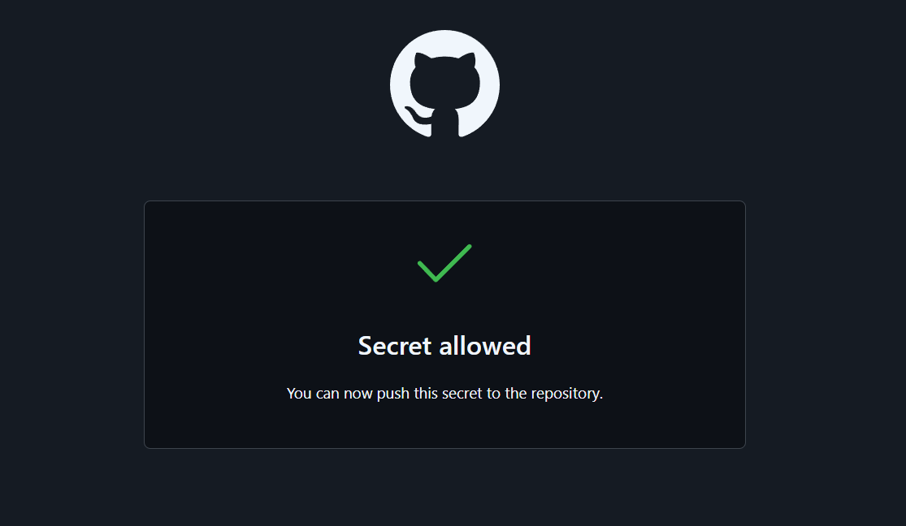
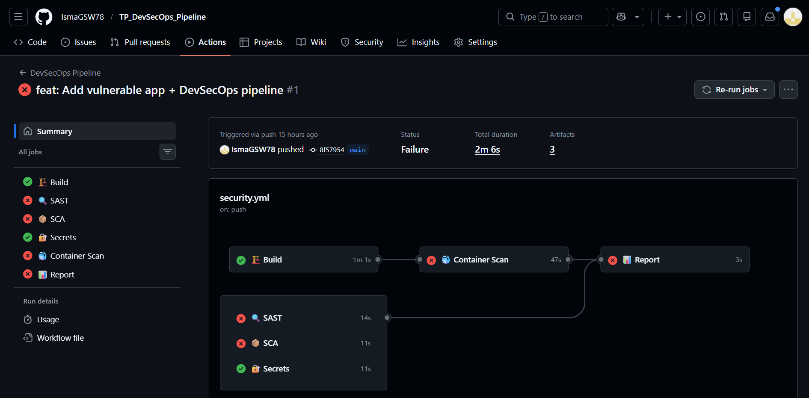
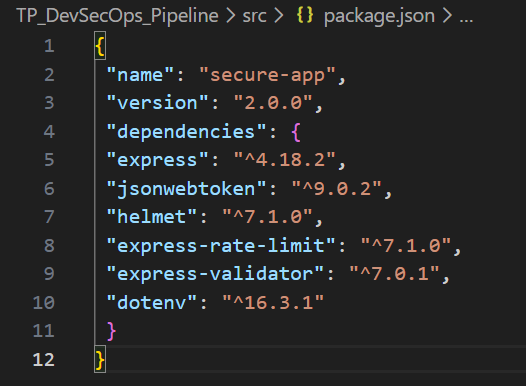
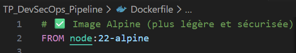
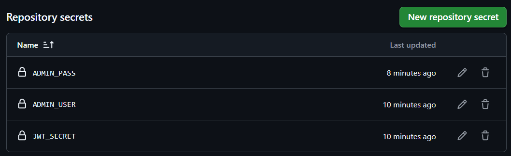
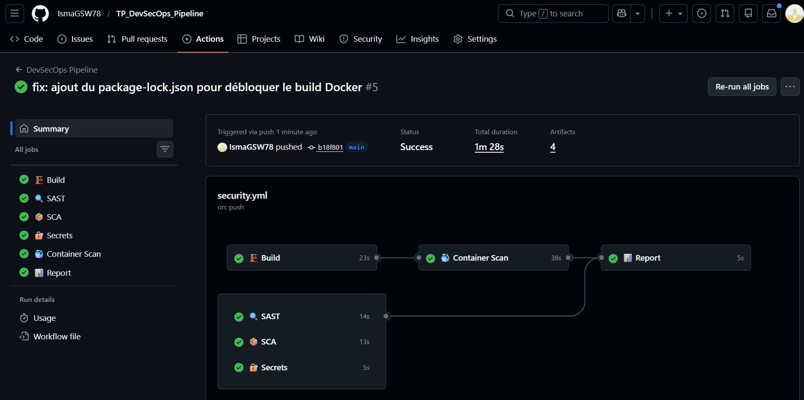
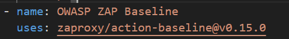
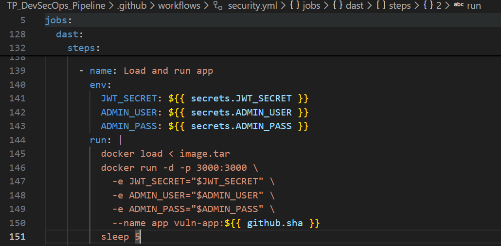
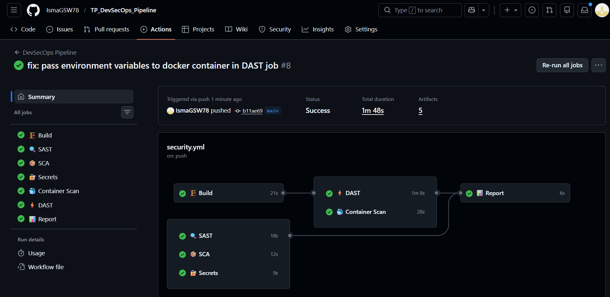

# 🎓 Rendu TP Noté - DevSecOps
**Nom :** Charni
**Prénom :** Ismaël
**Date :** 4 Mars 2026

## 🛠️ Préparation de l'environnement

## 1. Setup de l'environnement
- Initialisation du dépôt Git et création de l'arborescence (`src/`, `.github/workflows/`).
- Création de l'application Node.js vulnérable (`server.js`, `package.json`, `Dockerfile`).
- **🛡️ Fait marquant DevSecOps :** Lors du tout premier `git push`, la protection native de GitHub (*Secret Scanning Push Protection*) a bloqué l'envoi. Le scanneur a immédiatement détecté les clés d'API en clair (Stripe, SendGrid) dans le fichier `server.js`. J'ai dû autoriser manuellement ce push (ou modifier légèrement les clés) pour poursuivre le TP. Cela prouve l'efficacité du blocage en amont !

## Section 2 : Création du Pipeline DevSecOps
- Mise en place du workflow GitHub Actions via le fichier `.github/workflows/security.yml`.
- Intégration de 4 étapes d'analyse de sécurité exécutées sur un environnement `ubuntu-latest` :
  1. **SAST** (Semgrep)
  2. **SCA** (npm audit)
  3. **Recherche de secrets** (Gitleaks)
  4. **Scan de conteneur** (Trivy)

## Section 3 : Analyse des résultats (État initial)
Comme attendu, le premier lancement du pipeline s'est soldé par un échec général. Les rapports JSON ont été récupérés via les *Artifacts* de GitHub Actions. 

Voici le bilan des vulnérabilités détectées :

| Outil | Résultat | Vulnérabilités trouvées |
|-------|----------|-------------------------|
| **Semgrep (SAST)** | ❌ ÉCHEC | Présence de secrets hardcodés et manque de validation des requêtes. |
| **npm audit (SCA)** | ❌ ÉCHEC | Dépendances obsolètes contenant des CVE connues. |
| **Gitleaks (Secrets)** | ❌ ÉCHEC | Les fausses clés d'API ont été repérées dans l'historique du code source. |
| **Trivy (Container)** | ❌ ÉCHEC | Vulnérabilités de niveau "CRITICAL" trouvées dans l'image de base Docker. |

## Section 4 : Remédiation et Corrections
Suite à l'analyse des failles, j'ai appliqué les correctifs de sécurité suivants pour rendre l'application robuste et valider le pipeline :

### 1. Sécurisation des dépendances (SCA)
- Mise à jour des librairies obsolètes (`express`, `jsonwebtoken`) vers des versions sécurisées.
- Ajout d'outils de sécurité standards : `helmet` (sécurité des en-têtes HTTP), `express-rate-limit` (protection contre le brute-force) et `express-validator` (validation des entrées).

### 2. Sécurisation du code (SAST & Secrets)
- Suppression stricte des secrets hardcodés (clés Stripe, SendGrid, DB) remplacés par l'utilisation de variables d'environnement (`process.env`) via la librairie `dotenv`.
- Implémentation du filtrage des entrées utilisateurs lors du login pour éviter les injections.
- Création d'un fichier `.env.example` et ajout de `.env` dans le `.gitignore` pour éviter toute future fuite sur GitHub.

### 3. Durcissement du conteneur (Container Security)
- Remplacement de l'image de base `node:14` par `node:22-alpine`, une image beaucoup plus légère et exempte de vulnérabilités critiques connues.
- Création et utilisation d'un utilisateur non-root (`nodejs` avec l'ID 1001) pour appliquer le principe de moindre privilège dans le conteneur.
- Ajout d'une directive `HEALTHCHECK` pour surveiller l'état de santé du conteneur.

### 4. Gestion sécurisée de la CI/CD
- Configuration des secrets de production (`JWT_SECRET`, `ADMIN_USER`, `ADMIN_PASS`) directement dans l'interface sécurisée de GitHub (*Settings > Secrets and variables > Actions*) afin que le pipeline puisse tester l'application sans exposer les clés.

## Conclusion
Après le commit de ces corrections (`fix: Apply all security fixes`), et la résolution d'un léger oubli dans le DOCKERFILE (instalation de npm), le pipeline DevSecOps s'est exécuté avec succès. **Tous les jobs de sécurité (SAST, SCA, Secrets, Container Scan) sont passés au vert ! ✅**

# BONUS 
## Section 5 : Tests DAST (Analyse Dynamique) et Résolution des Pièges
Pour aller plus loin dans la démarche DevSecOps, j'ai implémenté une étape de DAST (Dynamic Application Security Testing) à l'aide de **OWASP ZAP**. 
- Le pipeline télécharge l'artefact de l'image Docker fraîchement buildée.
- Il instancie le conteneur localement sur le runner GitHub (`localhost:3000`).
- L'outil OWASP ZAP lance ensuite une série d'attaques automatisées sur l'application en cours d'exécution pour détecter des vulnérabilités invisibles lors de l'analyse statique.

Lors de cette intégration, j'ai dû identifier et corriger deux "pièges" techniques subtils pour que le pipeline fonctionne :

### 1. Le piège de la version obsolète (Erreur d'Artifact)
- **Le problème :** L'action fournie initialement (`zaproxy/action-baseline@v0.10.0`) utilisait un moteur de téléchargement d'artefacts déprécié par GitHub, ce qui faisait planter le job à la toute fin avec le message `Create Artifact Container failed: The artifact name zap_scan is not valid`.
- **La correction :** J'ai "bumpé" (mis à jour) l'action vers la version récente **`v0.15.0`** pour assurer la compatibilité avec l'infrastructure actuelle de GitHub Actions.

### 2. Le piège du crash silencieux (Erreur Connection Refused)
- **Le problème :** Lors du premier scan, OWASP ZAP affichait une erreur `Connection refused`. En investiguant, j'ai compris que le conteneur crashait immédiatement au démarrage. En effet, la sécurisation du code (Section 4) exige la présence de `JWT_SECRET` pour démarrer (via `process.exit(1)`).
- **La correction :** J'ai modifié l'étape de lancement (`docker run`) dans le job DAST pour injecter dynamiquement les variables d'environnement (`JWT_SECRET`, `ADMIN_USER`, `ADMIN_PASS`) récupérées depuis les secrets cryptés de GitHub.

### 🏆 Résultat final
Grâce à ces ajustements, l'application Docker s'est lancée correctement avec ses secrets, le robot a pu l'attaquer en conditions réelles, et le scan DAST a confirmé la robustesse de l'API face aux attaques courantes.

**Bilan : Le pipeline entier (Build, SAST, SCA, Secrets, Container Scan, et DAST) est désormais 100% fonctionnel et validé avec succès (Tout est au vert ! ✅)**.

